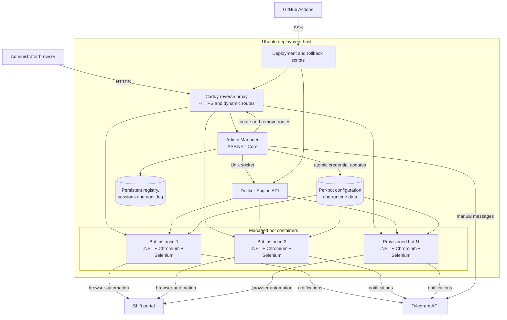

# GymBeam Shifts Automation

A production-oriented automation and operations platform for monitoring available
GymBeam work shifts, applying configurable selection rules, registering eligible
shifts through Selenium, and notifying users through Telegram.

The repository contains two applications:

- **Shift bot** — signs in to the shift portal, scans and prioritizes available
  shifts, registers matching shifts, and exposes a per-instance administration UI.
- **Admin Manager** — provisions and manages multiple isolated bot containers,
  credentials, logs, lifecycle operations, Telegram messages, and HTTPS routes.

> This is a personal automation project and is not an official GymBeam product.

## Screenshots

The screenshot slots below are intentionally reserved for the portfolio version
of the repository.

### Admin Manager dashboard

> **Screenshot placeholder** — add `docs/images/admin-manager-dashboard.png`.

<!-- Uncomment after adding the image:

-->

### Bot configuration

> **Screenshot placeholder** — add `docs/images/bot-configuration.png`.

<!-- Uncomment after adding the image:

-->

### Bot provisioning and operations

> **Screenshot placeholder** — add `docs/images/bot-provisioning.png`.

<!-- Uncomment after adding the image:

-->

## Architecture



### Main runtime flow

1. A bot opens Chromium, signs in to the shift portal, and refreshes the shift
   table at the configured interval.
2. It selects 100 rows per page, applies sorting, and collects a fresh combined
   list from pages 1–5, stopping earlier when pagination ends.
3. Configurable date, time, weekday, holiday, lead-time, and preferred-user rules
   are applied to the combined list.
4. Before registration, the bot returns to the recorded page and resolves a fresh
   DOM element by shift identifier, avoiding stale Selenium references.
5. After a successful registration, it refreshes the page and rebuilds the full
   list because all remaining rows may have moved between pages.
6. Success, availability, startup, status, and error notifications are delivered
   through Telegram.

## Key features

### Shift automation

- Selenium-based login and browser lifecycle management.
- Pagination-aware scanning of up to 500 visible shifts per scan.
- Configurable weekday, holiday, excluded-date, start-time, and minimum lead-time
  rules.
- Preferred-worker prioritization and explicit target-shift monitoring.
- Detection and persistent skipping of shifts reserved for new workers.
- Configurable lunch selection and repeated important-shift notifications.
- Recovery from stale DOM elements, disconnected WebDriver sessions, and failed
  login attempts with diagnostic HTML and screenshots.

### Administration and security

- Authenticated dashboard for bot status, logs, lifecycle actions, credentials,
  and Telegram messages.
- Signed sessions, CSRF protection, login rate limiting, security headers, and
  PBKDF2 password verification.
- Persistent session storage, audit logging, and bounded log responses.
- Atomic credential updates with startup recovery after interrupted operations.
- Strict bot identifier, Docker API, path, and provisioning validation.

### Multi-instance operations

- Isolated configuration and runtime storage for every bot.
- Dynamic bot provisioning, enabling, disabling, and deletion.
- Docker health checks and coordinated start, stop, and restart operations.
- Dynamic Caddy routes and automatic HTTPS certificates.
- Transactional provisioning and administration recovery.
- Resource limits for Chromium-based bot containers.

### Delivery and quality

- More than 400 unit, integration, security, deployment, and Selenium workflow
  tests.
- GitHub Actions restore, build, test, formatting, Docker, deployment-script, and
  Caddy validation.
- Docker image deployment over SSH with snapshots, health verification, and
  rollback support.
- Release builds currently complete with zero compiler warnings.

## Technology stack

| Area | Technology |
|---|---|
| Runtime | .NET 8, C# |
| Admin API/UI | ASP.NET Core minimal APIs, HTML, CSS, JavaScript |
| Browser automation | Selenium WebDriver, Chromium |
| Testing | xUnit, Moq, Selenium workflow tests |
| Containers | Docker Engine, Docker Compose |
| Reverse proxy | Caddy with automatic HTTPS |
| Notifications | Telegram Bot API |
| CI/CD | GitHub Actions, SSH deployment |
| Persistence | JSON/JSONL files with atomic transactions and recovery |

## Repository structure

```text
GymBeamShiftsControllerX/       Shift bot, per-instance admin UI and rules
GymBeamShiftsControllerX.Tests/ Shift bot unit, integration and Selenium tests
GymBeam.AdminManager/           Multi-instance management application
GymBeam.AdminManager.Tests/     Manager unit, security and integration tests
deploy/examples/                Safe configuration templates
scripts/                        Deployment, rollback and validation scripts
.github/workflows/ci.yml        CI and production deployment pipeline
docker-compose.yml              Bot, Admin Manager and Caddy stack
DEPLOY.md                       Production deployment and recovery guide
DOCKER_RUN.md                   Local Docker setup
```

## Local development

### Prerequisites

- .NET 8 SDK and .NET 9 SDK for the current test projects
- Chromium or Google Chrome
- Docker Engine with Docker Compose v2 for containerized execution

### Build and test

```bash
dotnet restore GymBeamShiftsController.sln
dotnet build GymBeamShiftsController.sln --configuration Release --no-restore
dotnet test GymBeamShiftsController.sln --configuration Release --no-build
dotnet format GymBeamShiftsController.sln --verify-no-changes --no-restore
```

Selenium workflow tests require a compatible local Chrome/Chromium installation.

### Run with Docker Compose

Create local runtime files from the safe examples:

```bash
mkdir -p instances/bot1/runtime-data instances/bot2/runtime-data
cp deploy/examples/bot.env.example instances/bot1/.env
cp deploy/examples/bot.env.example instances/bot2/.env
cp deploy/examples/appconfig.example.json instances/bot1/appconfig.json
cp deploy/examples/appconfig.example.json instances/bot2/appconfig.json
```

Replace every placeholder in the copied files with local credentials. Runtime
files under `instances/` are ignored by Git and must never be committed.

Validate and build the stack:

```bash
docker compose config --quiet
docker compose build gymbeam-bot-1 gymbeam-admin-manager
```

The checked-in Caddy configuration uses production hostnames. Do not start Caddy
locally unless DNS or local host routing has been configured intentionally. See
[DOCKER_RUN.md](DOCKER_RUN.md) for the complete local container workflow.

## Configuration

Configuration is supplied through per-instance `.env` and `appconfig.json`
files. The main groups cover:

- shift portal and Telegram credentials;
- browser mode and window size;
- polling, lead-time, restart, and notification timing;
- weekday, holiday, exclusion, preferred-user, and target-shift rules;
- per-instance administration credentials and session security.

Use only the templates in `deploy/examples/` as a starting point. Never place
real credentials, Telegram tokens, or signing keys in tracked files.

## CI/CD and deployment

Every push and pull request to `main` runs the full validation pipeline. A push
to `main` can deploy to the protected `production` GitHub Environment after the
test job succeeds.

The deployment job connects to the Ubuntu host over SSH, updates the checked-out
repository with a fast-forward-only pull, and runs `scripts/deploy.sh`. The script
captures a snapshot, rebuilds the shared bot image, recreates managed containers,
checks health, and rolls back on failure.

Required GitHub Environment secrets:

| Secret | Purpose |
|---|---|
| `SSH_HOST` | Ubuntu deployment host |
| `SSH_USER` | Deployment user |
| `SSH_PRIVATE_KEY` | GitHub Actions → Ubuntu SSH key |
| `DEPLOY_PATH` | Absolute repository path on the host |

The deployment host must independently have read access to the GitHub repository
because `git fetch origin main` runs on that host. See [DEPLOY.md](DEPLOY.md) for
server preparation, production operations, backups, and recovery.

## Security notes

- Real instance credentials stay on the deployment server.
- Secret and runtime paths are excluded by `.gitignore`.
- Admin Manager runs read-only, drops Linux capabilities, enables
  `no-new-privileges`, and accesses Docker through a constrained application
  layer.
- GitHub Actions dependencies are pinned to commit SHAs.
- Before publishing a fork, scan the complete Git history for accidentally
  committed credentials; checking only the current working tree is not enough.

## Current engineering trade-offs

- Browser automation depends on third-party DOM structure and therefore requires
  explicit waits and workflow regression tests.
- Some legacy bot administration HTML and orchestration still live in large C#
  service classes and are candidates for further separation.
- JSON persistence keeps deployment simple, while atomic transactions and startup
  recovery protect multi-step administrative operations.

## Further documentation

- [Local Docker workflow](DOCKER_RUN.md)
- [Production deployment and recovery](DEPLOY.md)
